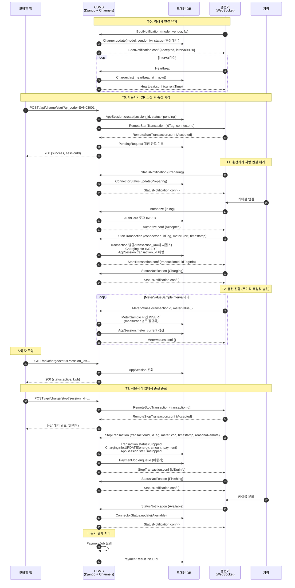
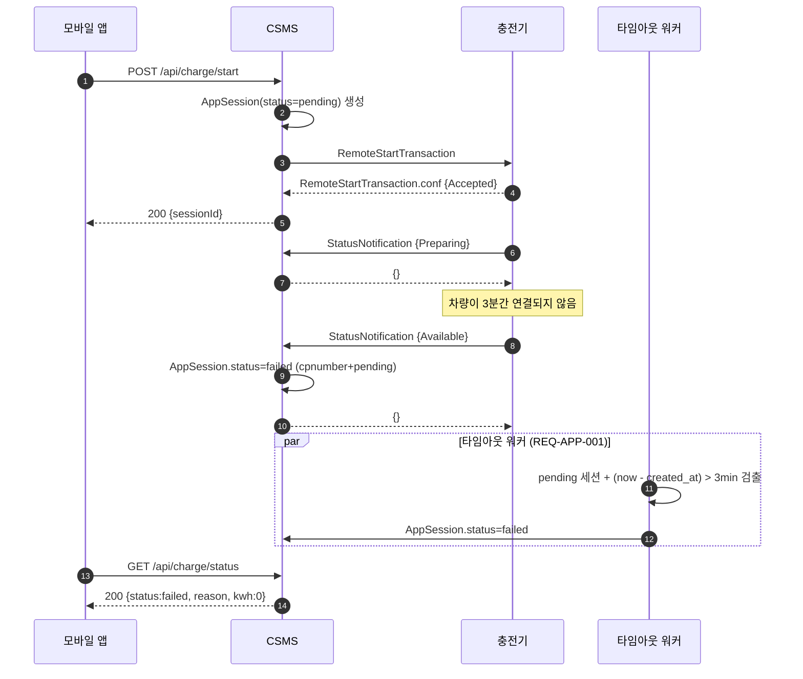
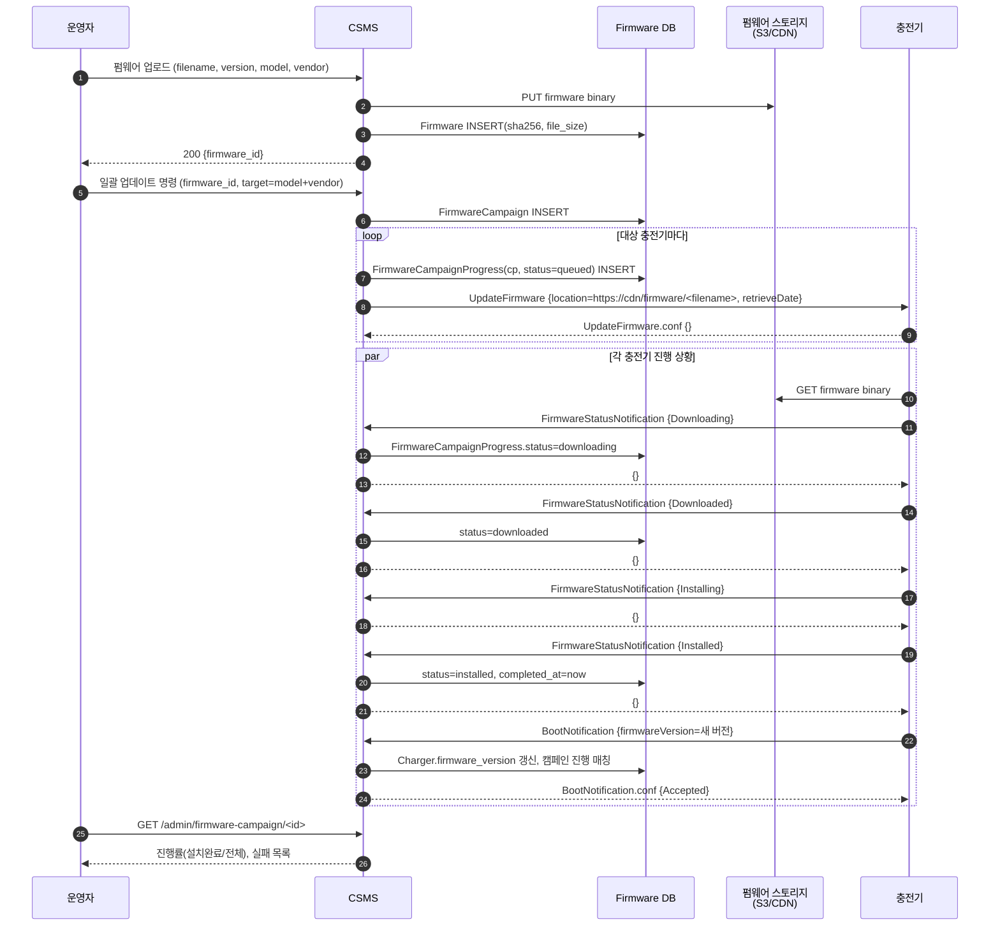
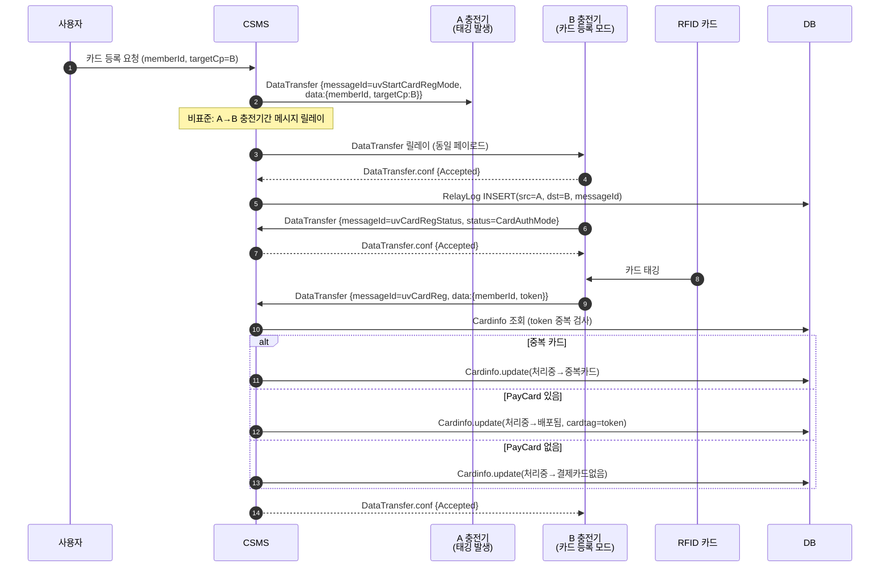
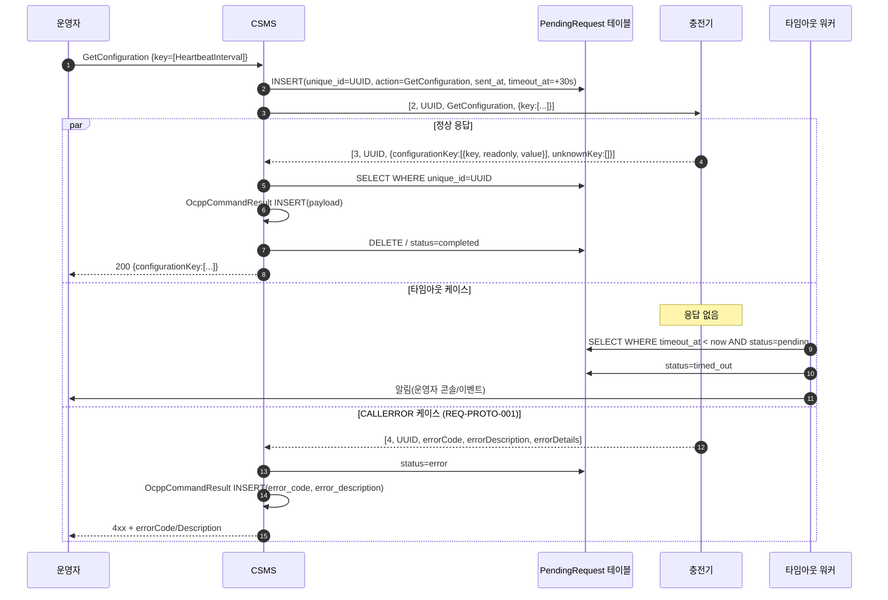

# 신규 CSMS 기능 명세서

> 작성일: 2026-05-08
> 대상 시스템: EVNEST 차세대 CSMS (Charging Station Management System)
> 기준 프로토콜: OCPP 1.6J (WebSocket + JSON)
> 본 문서의 목적: 현행 EVNEST CSMS 구현(`ocpp16/central_system.py`, `ocpp16/client_gateway.py`, `ocpp16/consumers.py`)을 분석하여 도출된 결함과 누락을 신규 CSMS의 기능 요구사항으로 전환하고, OCPP 1.6 표준과의 격차 및 운영 흐름을 명세화한다.

---

## 표기 규칙

본 문서의 요구사항은 RFC 2119를 따른다.

- **SHALL / MUST**: 절대 요구사항
- **SHOULD**: 강한 권고. 미준수 시 명시적 사유 필요
- **MAY**: 선택 가능
- **참조 표기**: `파일명:라인` (현행 구현 인용)

---

## 1. (a) 신규 CSMS 요구사항 — 결함 기반 SHALL 명세

현행 분석에서 도출한 14개 결함을 정성적 요구사항으로 전환한다.

### 1.1 프로토콜 적합성 (Protocol Conformance)

#### REQ-PROTO-001 — CALLERROR(MessageTypeId=4) 송수신 SHALL 구현

신규 CSMS는 OCPP-J 메시지 타입 4 (`CALLERROR`)를 다음과 같이 처리해야 한다.

- **수신**: 충전기가 보낸 CALLERROR를 파싱하여 `errorCode`(NotImplemented, NotSupported, InternalError, ProtocolError, SecurityError, FormationViolation, PropertyConstraintViolation, OccurenceConstraintViolation, TypeConstraintViolation, GenericError)와 `errorDescription`, `errorDetails`를 보존해야 한다.
- **송신**: 서버 처리 실패 시(예: 미구현 액션, 페이로드 검증 실패) CALLRESULT 대신 CALLERROR를 회신해야 한다.
- **저장**: `OcppMessageLog` 테이블에 메시지 타입을 enum(`Call/CallResult/CallError`)으로 보존.

> **현행 결함**: `consumers.py:55~116`의 `receive()`는 `text_data_json[0]`이 2 또는 그 외(else)만 분기하며, MessageTypeId=4 처리 분기가 없음. CALLERROR 수신 시 잘못된 컬럼에 데이터가 저장됨.

#### REQ-PROTO-002 — UniqueId 기반 요청-응답 매칭 SHALL 보장

각 OCPP CALL은 고유한 `UniqueId`(MessageId)를 가지며, 신규 CSMS는 송신한 요청과 수신한 응답을 `UniqueId`로 1:1 매칭해야 한다.

- 동일 충전기에 동시에 다수의 명령을 송신하더라도 각 응답이 어떤 요청에 대한 것인지 결정 가능해야 한다.
- 매칭은 인메모리 큐(asyncio.Future) 또는 영속 테이블(`PendingRequest(unique_id, cpnumber, action, sent_at, timeout_at)`) 중 하나로 구현. **단일 컬럼(`Clients.connection_id`) 갱신 방식은 금지.**
- 응답 타임아웃(기본 30초) 경과 시 해당 요청을 `TimedOut`으로 표시하고 호출자에게 통지해야 한다.

> **현행 결함**: `central_system.py:704 ocpp_conf_from_cp()`가 `Clients.connection_id` 단일 칸으로 매칭하므로, 동일 cpnumber에 두 명령을 연속으로 보내면 두 번째가 첫 번째의 connection_id를 덮어씀(race condition).

#### REQ-PROTO-003 — 미구현 액션 수신 시 CALLERROR(NotImplemented) 회신 SHALL

`central_system.py:679`처럼 `else: pass`로 침묵해서는 안 된다. 알 수 없는 액션은 명시적으로 `CALLERROR { errorCode: 'NotImplemented' }` 회신.

---

### 1.2 트랜잭션 관리 (Transaction Management)

#### REQ-TX-001 — `transactionId`는 시스템 전역 고유값으로 SHALL 발급

`StartTransaction.conf`에서 회신하는 `transactionId`는 정수형 시스템 시퀀스 또는 단조증가 카운터로 충전기 간 고유해야 한다.

- 동일 트랜잭션의 `MeterValues`, `StopTransaction`은 모두 동일 `transactionId`로 추적.
- `RemoteStopTransaction.req`는 종료 대상 `transactionId`를 정확히 지정해야 한다.

> **현행 결함**: `central_system.py:416` (`"transactionId": 1`), `client_gateway.py:422` (`{'transactionId': 1}`)이 모두 1로 하드코딩 → 다중 트랜잭션 추적 불가.

#### REQ-TX-002 — `connectorId`는 페이로드에서 SHALL 동적 결정

`UnlockConnector`, `RemoteStartTransaction`, `RemoteStopTransaction`, `ChangeAvailability`, `TriggerMessage`, `GetCompositeSchedule`, `ClearChargingProfile`, `SetChargingProfile`의 `connectorId` 파라미터는 호출자가 지정해야 하며 하드코딩(=1)을 금지한다. 듀얼 커넥터/멀티 건 충전기 운용을 위해 필수.

> **현행 결함**: `client_gateway.py:430` UnlockConnector의 `'connectorId': 1` 하드코딩, RemoteStart 단순 케이스도 connectorId 미지정.

#### REQ-TX-003 — 트랜잭션 상태 머신 SHALL 명시

신규 CSMS는 다음 상태 전이를 단일 트랜잭션 엔티티(`Transaction`)로 관리해야 한다.

```
Authorized → Started → InProgress → Stopping → Stopped
                                        ↓
                                  Aborted (timeout/error)
```

각 전이는 OCPP 메시지 수신 또는 타임아웃 이벤트와 1:1 대응. 외부에서 트랜잭션 ID로 현재 상태를 조회 가능해야 한다.

---

### 1.3 측정값 영속화 (Telemetry Persistence)

#### REQ-METER-001 — `MeterValues`의 모든 `measurand` SHALL 영속화

OCPP 1.6 표준 measurand 전체(아래 목록)를 `MeterSample(transaction_id, connector_id, timestamp, measurand, phase, location, unit, value)` 정규화 테이블에 저장해야 한다.

- `Energy.Active.Import.Register` (kWh 누적)
- `Energy.Reactive.Import.Register`
- `Power.Active.Import` (kW 순시)
- `Power.Reactive.Import`
- `Power.Factor`
- `Current.Import` (A)
- `Voltage` (V)
- `Frequency` (Hz)
- `Temperature` (°C)
- `SoC` (%, 차량 SoC가 OCPP 메시지로 전달되는 경우)
- 그 외 표준 measurand 전체

#### REQ-METER-002 — `MeterValues`는 `MeterValues.conf`로만 SHALL 회신

응답 페이로드는 `{}`. 측정값 저장 실패 시 CALLERROR 회신.

> **현행 결함**: `central_system.py:319~337`이 `Energy.Active.Import.Register`만 추출, AppSession에만 저장. 나머지 측정값은 모두 폐기.

---

### 1.4 상태 알림 (StatusNotification)

#### REQ-STATUS-001 — connectorId별 상태 SHALL 독립 관리

`StatusNotification`은 connectorId 0(전체 충전기) / 1, 2, ...(개별 커넥터)별로 별도 row에 저장.

- 스키마 권장: `ConnectorStatus(cpnumber, connector_id, status, error_code, info, vendor_error_code, updated_at)` 복합 PK `(cpnumber, connector_id)`.
- `Available`, `Preparing`, `Charging`, `SuspendedEVSE`, `SuspendedEV`, `Finishing`, `Reserved`, `Unavailable`, `Faulted` 9개 상태 모두 처리해야 한다(현재 Available, Preparing만 분기됨).

#### REQ-STATUS-002 — 에러 코드별 알림 정책 SHALL 명세

`errorCode`(ConnectorLockFailure, EVCommunicationError, GroundFailure, HighTemperature, InternalError, LocalListConflict, NoError, OtherError, OverCurrentFailure, OverVoltage, PowerMeterFailure, PowerSwitchFailure, ReaderFailure, ResetFailure, UnderVoltage, WeakSignal)별로 알림 채널과 자동조치(예: Reset) 정책을 운영 가능한 설정으로 분리.

> **현행 결함**: `central_system.py:230`이 `OverCurrentFailure` 한 종만 알림(`errorbizoauth`) 처리. connector별 상태 저장 코드는 237~244 전체가 주석처리됨.

---

### 1.5 응답 페이로드 보존 (Conf Payload Persistence)

#### REQ-CONF-001 — CSMS 송신 명령의 응답 페이로드 SHALL 영속화

`GetConfiguration.conf`의 `configurationKey[]`, `GetCompositeSchedule.conf`의 `chargingSchedule`, `GetDiagnostics.conf`의 `fileName`, `GetLocalListVersion.conf`의 `listVersion` 등 운영에 필요한 응답 데이터를 `OcppCommandResult(unique_id, action, status, payload, received_at)` 테이블에 저장.

- UI에서 명령 발송 후 응답 결과를 별도 조회로 확인 가능해야 한다.
- 응답이 없는 경우(timeout) `status=TimedOut`으로 기록.

> **현행 결함**: `central_system.py:704~785`가 모든 conf를 `print`로만 처리. `GetConfiguration` 응답에 들어 있는 충전기 설정값들이 화면이나 DB 어디에도 보존되지 않음.

---

### 1.6 멀티테넌시 (Multi-tenancy)

#### REQ-TENANT-001 — `company` SHALL 실제 분기 동작

신규 CSMS는 다음을 보장한다.

- 충전기 등록 시 `Company` 엔티티에 명시적으로 귀속. cpnumber prefix 기반 추정 금지.
- 모든 도메인 테이블은 `company_id` FK를 가지며, 모든 조회는 요청자 권한의 company로 자동 필터링.
- 운영자(staff)는 다중 company 권한 보유 가능, 일반 사용자/엔지니어는 단일 company.

> **현행 결함**: `consumers.py:14~19`, `central_system.py:34~37` 등 모든 `cpnumber.startswith('EVN')` 분기가 양쪽 모두 `'evnest'`로 귀결됨 — 사실상 단일 회사 구현.

---

### 1.7 BootNotification 처리

#### REQ-BOOT-001 — Rejected 응답 시 OCPP 표준 의미 SHALL 준수

미등록 cpnumber에 대해 `status=Rejected` 회신 시, `interval`은 OCPP 1.6 §4.2에 따라 **재시도 대기 간격**으로 사용된다. `currentTime`은 정상 회신.

- 신규 CSMS는 Rejected 시 `interval`을 운영 정책상 재시도 간격(권장: 300초 이상)으로 설정해야 한다.
- `Pending` 상태도 지원 SHOULD: 충전기 사전 등록 후 운영자 승인 절차가 있는 경우.

> **현행 결함**: `central_system.py:147~167`이 Rejected/Accepted 무관하게 동일 interval 반환.

#### REQ-BOOT-002 — 펌웨어 버전은 BootNotification에서 SHALL 신뢰

`firmwareVersion` 필드를 `Charger.firmware_version` 컬럼에 저장. 단, 펌웨어 업데이트 진행 중이라면 `Evchargerhistory` 류 이력 테이블의 최신 행도 동기화.

---

### 1.8 요금 계산 (Tariff)

#### REQ-TARIFF-001 — 요금제는 데이터 테이블로 SHALL 분리

cpnumber prefix(`EVN03`, `EVN07`, `EVN10`, `EVN50` 등)별 단가 분기를 코드에서 제거하고, 다음 스키마로 분리:

```
Tariff(id, name, charger_type, currency,
       energy_rate_low, energy_rate_mid, energy_rate_high,
       base_rate, valid_from, valid_to)

Charger.tariff_id → Tariff.id
```

- 시간대(경/중간/최대부하)는 KEPCO 요금표를 참조하는 별도 룰 테이블로 관리.
- 로밍 사업자별 단가(현행 PC/VT/CI/CP/PM/BE/SO/ST 등 8종)는 `RoamingTariff(roaming_partner_id, charger_type, rate)` 분리.

> **현행 결함**: `central_system.py:447~478`(로밍), `571~576`(일반), `pvpentech/views.py:198~203` 등 요금 단가가 코드 전반에 산재되어 있고 cpnumber prefix 분기로 표현됨.

#### REQ-TARIFF-002 — 결제 트리거 시점 SHALL 명세

`StopTransaction` 처리 완료 후 결제 승인을 발동하는 위치를 다음 중 하나로 명시한다.

- (옵션 A) `StopTransaction` 처리 트랜잭션 내에서 동기 호출
- (옵션 B) `Transaction.status=Stopped` 변경을 트리거로 비동기 잡 큐(예: Celery)에서 처리

선택된 방식을 코드 주석이 아닌 설계 문서에 기재. 결제 결과는 `PaymentResult(transaction_id, gateway, status, amount, paid_at, raw_response)`에 영속화.

> **현행 결함**: `central_system.py:602`의 `paymentcheck()` 호출이 주석처리되어 있어 결제가 OCPP 흐름에서 발동되지 않음. 어디서 발동되는지 코드만으로는 추적 불가.

---

### 1.9 펌웨어 업데이트

#### REQ-FW-001 — 펌웨어 다운로드 위치는 동적으로 SHALL 결정

`UpdateFirmware.req`의 `location` URL은 다음을 만족해야 한다.

- 호스트: `settings.FIRMWARE_BASE_URL` 환경변수에서 주입 (코드 하드코딩 금지)
- 경로: 운영자가 업로드한 실제 펌웨어 파일명을 참조 (인자 `filename`을 실제로 사용)
- 업로드 위치와 다운로드 경로를 통합: `MEDIA_ROOT/firmware/` → `MEDIA_URL + 'firmware/' + filename` (또는 별도 CDN URL)

#### REQ-FW-002 — 펌웨어 메타데이터 SHALL 관리

```
Firmware(id, filename, version, charger_model, charger_vendor,
        file_size, sha256, uploaded_by, uploaded_at, is_active)
```

- 충전기 모델/벤더별 필터링 가능
- 업데이트 명령 시 `Firmware.id`로 지정 → location URL 자동 생성
- 업로드 시 SHA256 해시 검증, 같은 파일명 재업로드 시 버전 충돌 사전 검출

#### REQ-FW-003 — 일괄 업데이트는 트랜잭션 단위로 SHALL 추적

같은 모델 일괄 업데이트(`AllUpdateFirmware`)는 `FirmwareCampaign(id, firmware_id, target_filter, started_by, started_at)` 캠페인 단위로 묶고, 각 충전기별 진행 상황을 `FirmwareCampaignProgress`에 행으로 분리.

> **현행 결함**: `client_gateway.py:86`에서 `location` 완전 하드코딩, `filename` 인자 무시. 업로드는 `media/`, 다운로드는 `static/firmware/`로 경로 단절. 운영자가 실제 펌웨어를 매번 `static/firmware/`에 수동 복사하는 절차가 묵시적으로 존재.

---

### 1.10 진단/원격 로그 (Diagnostics)

#### REQ-DIAG-001 — FTP 자격증명 SHALL 환경변수 분리 + 회전 가능

`GetDiagnostics.req`의 `location`(FTP/SFTP/HTTPS PUT URL)은 `settings.DIAGNOSTICS_UPLOAD_URL`로 분리. 자격증명은 환경변수에서만 주입하고 소스 저장소에 평문 저장 금지.

- 가능한 경우 SFTP 또는 HTTPS PUT으로 전환(평문 FTP 사용 지양)
- 자격증명 회전 시 코드 변경 없이 환경변수만 갱신으로 가능해야 함

#### REQ-DIAG-002 — `DiagnosticsStatusNotification` 상태 영속화 SHALL

진행 상태(`Idle/Uploaded/UploadFailed/Uploading`)를 `DiagnosticsRequest(unique_id, cpnumber, requested_at, status, file_name, completed_at)`로 추적.

> **현행 결함**: `client_gateway.py:312`에 FTP URL과 비밀번호(`evnest_ftp:!evnest702@3.37.224.145`) 평문 하드코딩. `central_system.py:313` DiagnosticsStatusNotification는 응답 `{}`만 회신, 상태 보존 안 됨.

---

### 1.11 DataTransfer (Vendor Extension)

#### REQ-DT-001 — vendorId/messageId별 핸들러 SHALL 분리 등록

`DataTransfer`는 OCPP 1.6 표준상 임의 확장점이므로, 신규 CSMS는 다음 구조를 갖는다.

- 핸들러 레지스트리: `(vendorId, messageId) → handler_function` 매핑
- 등록되지 않은 조합은 OCPP 표준 status `UnknownVendorId` 또는 `UnknownMessageId` 반환
- 각 핸들러는 별도 모듈에서 정의되어 코어 CSMS 코드 변경 없이 확장 가능

#### REQ-DT-002 — 충전기-충전기 릴레이는 명시적 기능으로 SHALL 분리

`uvStartCardRegMode` 같은 충전기→충전기 메시지 포워딩은 비표준 기능이므로 별도의 `RelayService`로 분리하고, 운영자에게 가시화(어느 충전기가 어느 충전기로 무엇을 보냈는지 로그).

> **현행 결함**: `central_system.py:249~311`에서 4개 messageId를 if-elif 체인으로 인라인 처리. 새 vendor 메시지 추가 시 코어 파일 수정 필요.

---

### 1.12 시간 처리 (Time Handling)

#### REQ-TIME-001 — 모든 OCPP 타임스탬프는 ISO 8601 UTC SHALL 준수

`Z` 접미사 사용. KST 등 로컬 시간을 그대로 송수신 금지.

#### REQ-TIME-002 — KST 보정은 표시 계층에서만 SHALL 수행

`(datetime.now() - timedelta(hours=9))` 같은 수동 시간대 보정 코드는 OCPP 메시지 빌드 단계에서 제거. UI/문자메시지 등 표시 계층에서만 `Asia/Seoul` 변환.

> **현행 결함**: `client_gateway.py:213` `ReserveNow.expiryDate` 빌드에 `-timedelta(hours=9)` 수동 보정 — 충전기 측 시간대 가정에 따라 호환성 문제 발생.

---

### 1.13 앱 세션 동시성 (App Session Concurrency)

#### REQ-APP-001 — `AppSession`은 `transaction_id` 기반으로 SHALL 매핑

현행 `cpnumber` 단일 키 매칭은 race condition 위험.

- `AppSession.transaction_id` 컬럼 추가, `StartTransaction.conf` 발급 시 양방향 매핑 확정.
- `StatusNotification(Available)`만으로 `pending → failed` 처리하지 말고, RemoteStart 발송 후 N분 내 `StartTransaction` 미수신을 별도 타임아웃 워커로 검출.

#### REQ-APP-002 — 세션 단위 idempotency SHALL 보장

같은 `session_id`로 중복 stop 호출 시 멱등 응답. 같은 충전기에 동시 두 사용자의 RemoteStart는 409 Conflict로 거부.

> **현행 결함**: `central_system.py:221`이 `cpnumber + status='pending'` 첫 행만 사용. RemoteStart 직후 다른 카드로 충전기에서 직접 시작하는 경우 잘못된 세션이 active로 전환될 위험.

---

### 1.14 보안 (Security)

#### REQ-SEC-001 — 모든 CP-CSMS 통신은 WSS(TLS) 위에서 SHALL 동작

평문 WS는 개발 환경 한정. 운영 환경은 WSS 강제.

#### REQ-SEC-002 — 충전기 인증 SHALL 명시

OCPP 1.6 보안 가이드에 따라 다음 중 하나 이상:

- (Profile 1) HTTP Basic Auth (cpnumber + secret)
- (Profile 2) TLS + Basic Auth
- (Profile 3) TLS + 클라이언트 인증서

신규 CSMS는 최소 Profile 1을 강제하고, Profile 3을 옵션으로 지원해야 한다.

#### REQ-SEC-003 — 비밀정보 저장 금지

API 키, FTP 비밀번호, JWT secret은 환경변수 또는 시크릿 매니저(AWS Secrets Manager 등)로만 주입. `settings.py` 또는 `my_settings.py`에 평문 저장 금지.

---

## 2. (b) OCPP 1.6 표준 vs 현재 구현 비교

각 메시지의 OCPP 1.6 표준 페이로드 필드와 현행 EVNEST 구현이 처리/저장하는 필드를 비교한다.

> 표 컬럼: **표준 필드** / **타입** / **필수** / **현행 처리** / **비고**
> 현행 처리: ✅(완전 처리) / ⚠️(부분/누락) / ❌(미처리)

### 2.1 CP → CSMS 메시지

#### 2.1.1 BootNotification

| 표준 필드 | 타입 | 필수 | 현행 | 비고 |
|---|---|---|---|---|
| chargePointVendor | string(20) | Y | ✅ `vendor`로 저장 | |
| chargePointModel | string(20) | Y | ✅ `model`로 저장 | |
| chargePointSerialNumber | string(25) | N | ❌ | 신규: `Charger.serial_no` 추가 |
| chargeBoxSerialNumber | string(25) | N | ❌ | OCPP 1.6에서 deprecated이지만 보존 권장 |
| firmwareVersion | string(50) | N | ⚠️ try/except로만 처리, 실패 시 `print('fw_version 실패')` | |
| iccid | string(20) | N | ❌ | 셀룰러 모뎀 식별 |
| imsi | string(20) | N | ❌ | |
| meterType | string(25) | N | ❌ | |
| meterSerialNumber | string(25) | N | ❌ | |
| **응답: status** | enum | Y | ⚠️ Accepted/Rejected만, Pending 미지원 | |
| **응답: currentTime** | dateTime | Y | ✅ | |
| **응답: interval** | integer | Y | ⚠️ Rejected에도 정상 interval 반환 | OCPP 4.2.1 위반 가능 |

#### 2.1.2 Heartbeat

| 표준 필드 | 타입 | 필수 | 현행 | 비고 |
|---|---|---|---|---|
| (요청 페이로드 없음) | — | — | — | |
| **응답: currentTime** | dateTime | Y | ✅ | |

> 현행은 마지막 Heartbeat 시각을 충전기 단위로 저장하지 않음 → online/offline 판정 불가. 신규: `Charger.last_heartbeat_at` 갱신 필요.

#### 2.1.3 Authorize

| 표준 필드 | 타입 | 필수 | 현행 | 비고 |
|---|---|---|---|---|
| idTag | IdToken(20) | Y | ✅ | |
| **응답: idTagInfo.status** | enum | Y | ✅ Accepted/Blocked/Expired/Invalid/ConcurrentTx | |
| **응답: idTagInfo.expiryDate** | dateTime | N | ❌ | 카드 유효기간 표시 가능 |
| **응답: idTagInfo.parentIdTag** | IdToken | N | ⚠️ idTag 자기 자신을 그대로 회신 | 부모 카드 개념 미사용 |

#### 2.1.4 StartTransaction

| 표준 필드 | 타입 | 필수 | 현행 | 비고 |
|---|---|---|---|---|
| connectorId | integer | Y | ❌ 페이로드에서 읽지 않음 | 듀얼 커넥터 미지원 원인 |
| idTag | IdToken | Y | ✅ | |
| meterStart | integer(Wh) | Y | ✅ | |
| reservationId | integer | N | ❌ | ReserveNow와 연계 불가 |
| timestamp | dateTime | Y | ⚠️ `%fZ`/`Z` 두 포맷만 try/except | tz 부재 포맷도 다수 |
| **응답: idTagInfo** | object | Y | ✅ | |
| **응답: transactionId** | integer | Y | ❌ **항상 1로 하드코딩** | REQ-TX-001 |

#### 2.1.5 StopTransaction

| 표준 필드 | 타입 | 필수 | 현행 | 비고 |
|---|---|---|---|---|
| idTag | IdToken | N | ✅ | |
| meterStop | integer(Wh) | Y | ✅ | |
| timestamp | dateTime | Y | ⚠️ 동일 문제 | |
| transactionId | integer | Y | ❌ 페이로드에서 읽지 않음, cpnumber로 매칭 | |
| reason | enum | N | ❌ EmergencyStop/EVDisconnected/HardReset/Local/Other/PowerLoss/Reboot/Remote/SoftReset/UnlockCommand/DeAuthorized 미저장 | 운영 분석에 중요 |
| transactionData | MeterValue[] | N | ❌ | 종료 시 누적 측정치, 일부 충전기가 활용 |
| **응답: idTagInfo** | object | N | ✅ | |

#### 2.1.6 MeterValues

| 표준 필드 | 타입 | 필수 | 현행 | 비고 |
|---|---|---|---|---|
| connectorId | integer | Y | ❌ | |
| transactionId | integer | N | ❌ | 트랜잭션 매칭 불가 |
| meterValue[].timestamp | dateTime | Y | ❌ | |
| meterValue[].sampledValue[].value | string | Y | ⚠️ Energy.Active.Import.Register만 | |
| sampledValue.context | enum | N | ❌ Interruption.Begin/End, Sample.Clock, Sample.Periodic, Transaction.Begin/End, Trigger, Other | |
| sampledValue.format | enum | N | ❌ Raw/SignedData | |
| sampledValue.measurand | enum | N | ⚠️ 1종만 처리 | REQ-METER-001 |
| sampledValue.phase | enum | N | ❌ L1/L2/L3/N/L1-N/L2-N/L3-N/L1-L2/L2-L3/L3-L1 | |
| sampledValue.location | enum | N | ❌ Body/Cable/EV/Inlet/Outlet | |
| sampledValue.unit | enum | N | ❌ Wh/kWh/varh/kvarh/W/kW/VA/kVA/var/kvar/A/V/Celsius/Fahrenheit/K/Percent | 단위 가정 검증 필요 |

#### 2.1.7 StatusNotification

| 표준 필드 | 타입 | 필수 | 현행 | 비고 |
|---|---|---|---|---|
| connectorId | integer | Y | ⚠️ 읽기는 하나 connector별 저장 안 함 | REQ-STATUS-001 |
| errorCode | enum | Y | ⚠️ OverCurrentFailure만 분기 | REQ-STATUS-002 |
| info | string(50) | N | ❌ | 에러 부가 설명 |
| status | enum | Y | ⚠️ Available/Preparing만 분기 | 9개 중 2개만 |
| timestamp | dateTime | N | ❌ | |
| vendorId | string(255) | N | ❌ | |
| vendorErrorCode | string(50) | N | ❌ | |
| **응답** | (빈 객체) | — | ✅ | |

#### 2.1.8 DataTransfer

| 표준 필드 | 타입 | 필수 | 현행 | 비고 |
|---|---|---|---|---|
| vendorId | string(255) | Y | ❌ 페이로드에서 읽지 않음 | 동일 messageId 충돌 시 vendorId로 분기 불가 |
| messageId | string(50) | N | ⚠️ 4종만 if-elif | REQ-DT-001 |
| data | string(*) | N | ⚠️ messageId별 인라인 파싱 | |
| **응답: status** | enum | Y | ⚠️ Accepted/UnknownMessageId만, UnknownVendorId/Rejected 미사용 | |
| **응답: data** | string | N | ⚠️ BatteryInfo만 | |

#### 2.1.9 FirmwareStatusNotification

| 표준 필드 | 타입 | 필수 | 현행 | 비고 |
|---|---|---|---|---|
| status | enum | Y | ✅ Downloaded/DownloadFailed/Downloading/Idle/InstallationFailed/Installed/Installing | OCPP 표준 7개 vs 현행 6개 매핑(Idle 누락) |
| **응답** | (빈 객체) | — | ✅ | |

#### 2.1.10 DiagnosticsStatusNotification

| 표준 필드 | 타입 | 필수 | 현행 | 비고 |
|---|---|---|---|---|
| status | enum | Y | ❌ Idle/Uploaded/UploadFailed/Uploading 미저장 | REQ-DIAG-002 |
| **응답** | (빈 객체) | — | ✅ | |

---

### 2.2 CSMS → CP 메시지

#### 2.2.1 Reset

| 표준 필드 | 타입 | 필수 | 현행 | 비고 |
|---|---|---|---|---|
| type | enum | Y | ✅ Hard/Soft (빈 문자열이면 soft 기본값) | |
| **응답: status** | enum | Y | ⚠️ print만 | REQ-CONF-001 |

#### 2.2.2 ChangeAvailability

| 표준 필드 | 타입 | 필수 | 현행 | 비고 |
|---|---|---|---|---|
| connectorId | integer | Y | ❌ 빌더 함수 자체 없음 | OCPP 핵심 운영 명령인데 미구현 |
| type | enum | Y | ❌ Inoperative/Operative | |
| **응답: status** | enum | Y | ⚠️ 응답 매처에 분기는 있으나 print만 | |

#### 2.2.3 ChangeConfiguration

| 표준 필드 | 타입 | 필수 | 현행 | 비고 |
|---|---|---|---|---|
| key | CiString50 | Y | ✅ | |
| value | string(500) | Y | ✅ | |
| **응답: status** | enum | Y | ⚠️ print만, Accepted/Rejected/RebootRequired/NotSupported 구분 없음 | |

#### 2.2.4 GetConfiguration

| 표준 필드 | 타입 | 필수 | 현행 | 비고 |
|---|---|---|---|---|
| key[] | CiString50[] | N | ✅ | |
| **응답: configurationKey[]** | object[] | N | ❌ key/readonly/value 배열 미보존 | REQ-CONF-001 |
| **응답: unknownKey[]** | string[] | N | ❌ | |

> 가장 중요한 누락. 충전기의 OCPP 설정값(Heartbeat 주기, MeterValueSampleInterval 등)을 화면에 표시할 수 없음.

#### 2.2.5 ClearCache

| 표준 필드 | 타입 | 필수 | 현행 | 비고 |
|---|---|---|---|---|
| (페이로드 없음) | — | — | ✅ | |
| **응답: status** | enum | Y | ⚠️ print만 | |

#### 2.2.6 RemoteStartTransaction

| 표준 필드 | 타입 | 필수 | 현행 | 비고 |
|---|---|---|---|---|
| connectorId | integer | N | ⚠️ ChargingProfile 케이스만 1로 고정 | REQ-TX-002 |
| idTag | IdToken | Y | ✅ | |
| chargingProfile | object | N | ⚠️ 샘플 페이로드 인라인 하드코딩 (W 단위, 3구간) | 실제 운영 가능한 동적 빌더 필요 |
| **응답: status** | enum | Y | ⚠️ Accepted/Rejected 분기 print | |

#### 2.2.7 RemoteStopTransaction

| 표준 필드 | 타입 | 필수 | 현행 | 비고 |
|---|---|---|---|---|
| transactionId | integer | Y | ❌ **1로 하드코딩** | REQ-TX-001 |
| **응답: status** | enum | Y | ⚠️ print만 | |

#### 2.2.8 UnlockConnector

| 표준 필드 | 타입 | 필수 | 현행 | 비고 |
|---|---|---|---|---|
| connectorId | integer | Y | ❌ 1로 하드코딩 | REQ-TX-002 |
| **응답: status** | enum | Y | ⚠️ Unlocked/UnlockFailed/NotSupported 미구분 | |

#### 2.2.9 TriggerMessage

| 표준 필드 | 타입 | 필수 | 현행 | 비고 |
|---|---|---|---|---|
| requestedMessage | enum | Y | ✅ | BootNotification/DiagnosticsStatusNotification/FirmwareStatusNotification/Heartbeat/MeterValues/StatusNotification |
| connectorId | integer | N | ❌ | MeterValues/StatusNotification 트리거 시 특정 커넥터 지정 불가 |
| **응답: status** | enum | Y | ⚠️ print만 | |

#### 2.2.10 GetDiagnostics

| 표준 필드 | 타입 | 필수 | 현행 | 비고 |
|---|---|---|---|---|
| location | URI | Y | ⚠️ FTP 평문 + 자격증명 하드코딩 | REQ-SEC-003 |
| retries | integer | N | ✅ 1로 고정 | |
| retryInterval | integer | N | ✅ 1로 고정 | |
| startTime | dateTime | N | ⚠️ register_dttm 기본값 | |
| stopTime | dateTime | N | ⚠️ now 기본값 | |
| **응답: fileName** | string(255) | N | ❌ | 진단 파일명 미보존 |

#### 2.2.11 UpdateFirmware

| 표준 필드 | 타입 | 필수 | 현행 | 비고 |
|---|---|---|---|---|
| location | URI | Y | ❌ **호스트+파일명 모두 하드코딩** | REQ-FW-001 |
| retries | integer | N | ✅ 1 | |
| retrieveDate | dateTime | Y | ✅ now | |
| retryInterval | integer | N | ✅ 1 | |
| **응답** | (빈 객체) | — | ✅ | |

#### 2.2.12 ReserveNow

| 표준 필드 | 타입 | 필수 | 현행 | 비고 |
|---|---|---|---|---|
| connectorId | integer | Y | ✅ | |
| expiryDate | dateTime | Y | ⚠️ `now+1min-9h` 수동 KST 보정 | REQ-TIME-002 |
| idTag | IdToken | Y | ✅ | |
| parentIdTag | IdToken | N | ❌ | |
| reservationId | integer | Y | ✅ | |
| **응답: status** | enum | Y | ⚠️ print만, Accepted/Faulted/Occupied/Rejected/Unavailable | |

#### 2.2.13 CancelReservation

| 표준 필드 | 타입 | 필수 | 현행 | 비고 |
|---|---|---|---|---|
| reservationId | integer | Y | ✅ | |
| **응답: status** | enum | Y | ⚠️ print만 | |

#### 2.2.14 GetLocalListVersion

| 표준 필드 | 타입 | 필수 | 현행 | 비고 |
|---|---|---|---|---|
| (페이로드 없음) | — | — | ✅ | |
| **응답: listVersion** | integer | Y | ❌ 보존 안 됨 | REQ-CONF-001 |

#### 2.2.15 SendLocalList

| 표준 필드 | 타입 | 필수 | 현행 | 비고 |
|---|---|---|---|---|
| listVersion | integer | Y | ✅ | |
| localAuthorizationList[] | object[] | N | ❌ **카드 목록 자체를 안 보냄** | 핵심 페이로드 누락, 사실상 무용 |
| updateType | enum | Y | ✅ Differential/Full | |
| **응답: status** | enum | Y | ⚠️ print만 | |

#### 2.2.16 SetChargingProfile

| 표준 필드 | 타입 | 필수 | 현행 | 비고 |
|---|---|---|---|---|
| connectorId | integer | Y | ✅ | |
| csChargingProfiles | object | Y | ⚠️ 호출자가 통째로 전달 (검증 없음) | |
| **응답: status** | enum | Y | ⚠️ print만 | |

#### 2.2.17 ClearChargingProfile

| 표준 필드 | 타입 | 필수 | 현행 | 비고 |
|---|---|---|---|---|
| id | integer | N | ✅ 1로 고정 | |
| connectorId | integer | N | ✅ | |
| chargingProfilePurpose | enum | N | ❌ | |
| stackLevel | integer | N | ❌ | |
| **응답: status** | enum | Y | ⚠️ print만 | |

#### 2.2.18 GetCompositeSchedule

| 표준 필드 | 타입 | 필수 | 현행 | 비고 |
|---|---|---|---|---|
| connectorId | integer | Y | ✅ | |
| duration | integer | Y | ✅ | |
| chargingRateUnit | enum | N | ❌ A/W | |
| **응답: status** | enum | Y | ⚠️ print만 | |
| **응답: chargingSchedule** | object | N | ❌ 핵심 데이터 폐기 | REQ-CONF-001 |

#### 2.2.19 DataTransfer (CSMS → CP)

| 표준 필드 | 타입 | 필수 | 현행 | 비고 |
|---|---|---|---|---|
| vendorId | string(255) | Y | ✅ Evcharger.vendor에서 조회 | |
| messageId | string(50) | N | ✅ uvStartCardRegMode | |
| data | string(*) | N | ✅ | |
| **응답: status, data** | — | — | ⚠️ print만 | |

---

### 2.3 표준에 있으나 현행 빌더가 없는 명령

다음 OCPP 1.6 명령은 빌더 함수 자체가 없어 운영자가 발송할 수 없다. 신규 CSMS는 모두 구현해야 한다.

- `ChangeAvailability` (커넥터 점검 모드 전환)
- `ExtendedTriggerMessage` (OCPP 1.6 보안 확장이지만, 표준 1.6에는 미포함이므로 옵션)

---

## 3. (c) 시퀀스 다이어그램

전체 충전 1회 흐름을 5개의 Mermaid 시퀀스 다이어그램으로 분리한다.

### 3.1 전체 충전 라이프사이클 (정상 케이스, 모바일 앱 시작)



### 3.2 차량 미연결로 인한 충전 시작 실패 (현행 변경 #2 시나리오)



### 3.3 펌웨어 업데이트 (REQ-FW-001 적용 후 신규 흐름)



### 3.4 신규 카드 등록 (DataTransfer 충전기 릴레이, REQ-DT-002 적용)



### 3.5 운영자 명령 발송 + 응답 매칭 (REQ-PROTO-002 적용)



---

## 4. 데이터 모델 권장안 (요약)

본 문서의 요구사항을 충족하기 위한 핵심 신규 테이블 목록.

| 테이블 | 목적 | 핵심 컬럼 |
|---|---|---|
| `Company` | 멀티테넌트 루트 | id, name, code |
| `Charger` | 충전기 마스터 (현 Evcharger) | id, cpnumber, company_id, model, vendor, serial_no, fw_version, last_heartbeat_at, tariff_id |
| `Connector` | 커넥터 단위 | id, charger_id, connector_id (1..N), type |
| `ConnectorStatus` | StatusNotification 최신 상태 | charger_id, connector_id, status, error_code, info, vendor_error_code, updated_at |
| `Transaction` | OCPP 트랜잭션 | id (시퀀스, =transactionId), charger_id, connector_id, id_tag, started_at, stopped_at, meter_start, meter_stop, stop_reason, status |
| `MeterSample` | MeterValues 정규화 | transaction_id, timestamp, measurand, phase, location, unit, value, context, format |
| `OcppMessageLog` | 송수신 raw 로그 (현 Ocpp16) | id, charger_id, msg_type(Call/CallResult/CallError), unique_id, action, payload, direction, created_at |
| `PendingRequest` | 송신 명령 응답 매칭 | unique_id, charger_id, action, sent_at, timeout_at, status |
| `OcppCommandResult` | 명령 응답 결과 | unique_id, action, status, payload, received_at |
| `Firmware` | 펌웨어 마스터 | id, filename, version, charger_model, charger_vendor, sha256, file_size, uploaded_at, is_active |
| `FirmwareCampaign` | 일괄 업데이트 캠페인 | id, firmware_id, target_filter, started_by, started_at |
| `FirmwareCampaignProgress` | 캠페인별 충전기 진행 | campaign_id, charger_id, status, started_at, completed_at, error |
| `DiagnosticsRequest` | 진단 요청/결과 | unique_id, charger_id, requested_at, status, file_name, completed_at |
| `Tariff` | 요금제 마스터 | id, name, charger_type, energy_rate_low/mid/high, base_rate, valid_from/to |
| `RoamingTariff` | 로밍 사업자별 단가 | roaming_partner_id, charger_type, rate |
| `PaymentJob` / `PaymentResult` | 결제 비동기 처리 | transaction_id, gateway, status, amount, paid_at, raw_response |
| `RelayLog` | 충전기 간 DataTransfer 릴레이 감사 | src_charger_id, dst_charger_id, message_id, payload, created_at |

---

## 5. 우선순위 제안

신규 CSMS 구축 시 다음 순서로 구현 권장.

| 단계 | 범위 | 사유 |
|---|---|---|
| 1 | REQ-PROTO-001~003 (전송 계층, CALLERROR, UniqueId 매칭) | 모든 후속 기능의 토대 |
| 2 | REQ-TX-001~003 (트랜잭션) | 결제/통계의 정확성 직결 |
| 3 | REQ-METER-001~002, REQ-STATUS-001~002 | 모니터링/장애 감지 핵심 |
| 4 | REQ-CONF-001 (응답 보존) | 운영자 도구 사용성 |
| 5 | REQ-FW-001~003, REQ-DIAG-001~002 | 운영 자동화 |
| 6 | REQ-TARIFF-001~002, REQ-APP-001~002 | 비즈니스 정확성 |
| 7 | REQ-TENANT-001, REQ-SEC-001~003 | 다회사/보안 강화 |
| 8 | REQ-DT-001~002, REQ-TIME-001~002 | 확장성/표준 적합성 |

---

## 6. 부록: 참조 파일 (현행 구현)

- WebSocket 진입점: `ocpp16/consumers.py`
- CP→CSMS 처리: `ocpp16/central_system.py:30 ocpp_request()`
- CSMS→CP 응답 매처: `ocpp16/central_system.py:704 ocpp_conf_from_cp()`
- CSMS→CP 송신 빌더: `ocpp16/client_gateway.py`
- WebSocket 라우팅: `ocpp16/routing.py`
- 메시지 로그 모델: `ocpp16/models.py Ocpp16`
- 충전기 마스터: `evcharger/models.py Evcharger, Evchargerhistory`
- 트랜잭션 본문: `charginginfo/models.py Charginginfo`
- 요금 계산: `charginginfo/kepco_tariff.py calculate_price()`
- 앱 세션: `pvpentech/models.py AppSession`, `pvpentech/views.py`
- 운영자 명령 UI: `clients/views.py`, `clients/templates/clients.html`
